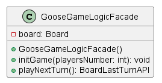

# Goose Game
Goose Game Logic built with JDK 11.0.12.

## Domain problem
The logic of this game is the same than the original goose board game, with the exception that when users play their first turn and the value of their dice thrown is 9, being the thrown values of dice 3 and 6, they move to square 23 instead of 26.

Rules were extracted from [Spanish Goose Game Wikipedia page](https://es.wikipedia.org/wiki/Juego_de_la_oca), consulted between June and July of 2023.

## Architecture Design

### Polymorphism with Square
As the game has different kind of Square whose behavior defers depending on their specific kind, it was decided to create an abstract Square class whose abstract method *landedOn* is implemented in their children:
- BridgeSquare
- BronzeSquare
- DiceSquare
- GooseSquare
- InnSquare
- LabyrinthSquare
- JailSquare
- RegularSquare
- SkullSquare

Tradeoffs of this decision:
- Implementing new children of Square does not break existing children and they can reuse existing functionality already built in Board

UML class diagram:

### Board and Mediator pattern where Square acts as participant
Board is the information expert of squares. It is responsible of:
- knowing how many squares there are,
- knowing in which squares players are located, and
- performing the corresponding operations during the game

So, though squares own a different behavior depending on its kind, this behavior is performed by Board, actually. Board acts here as a mediator while squares are participants.

Tradeoffs of this decision:
- Too much functionality in Board class can lead to the so-called God class antipattern.

### Dice: model, service and Singleton pattern
DiceModel is a simple class providing methods for rolling and getting value.

DiceService provides methods for:
- get the value of 1 dice rolled
- get the value of 2 dice rolled
- get the value of 2 dice rolled with a different return values in these cases:
-- dice values are 3 and 6
-- dice values are 4 and 5

DiceServiceSingleton gives the only instance of DiceService needed in execution time.

Tradeoffs of this decision:
- If new functionality is needed as for dice, it is only necessary to implement in DiceService not breaking existing uses if it

UML class diagram:

### Player and State pattern
As players' behavior varies depending on its state, the behavior is delegated to its state.

So, what players do during their turn depends on:
- It is player's 1st turn
- It is a regular turn with 2 dice
- Player is in a square from which (s)he must use 1 dice
- Player cannot play in x number of turns

Tradeoffs of this decision:
- 1 new state needs change in various places, but it protects existing player use from being broken

UML class diagram:

### Board and State pattern
System is designed so that once game is over, no more actions are allowed unless a new game is initiated.

So, Board object acts differently when game is running from when is over. State pattern was implemented to avoid checking if the game is over before every single turn (*Tell-Don't-Ask*).

Tradeoffs of this decision:
- 1 additionally class that does nothing: GameOverState
- 1 less computational step in every single turn played

UML class diagram:

### Handler pattern for Player and Board states
This decision might be an example of over-engineering. Anyway, the reasoning of its implementation is to hide complex code by providing methods with more intuitive names.

For instance,

`PlayerStateHandler.setNoTurnsState(player, turnsNumber);`

is more intuitive than:

`player.setPlayerState(new PlayerNoTurnsState(player, turnsNumber));`

Tradeoffs of this decision:
- Adds an additional layer that:
  - reduce performance, and
  - reduce complexity

### GooseGameLogic and Facade pattern
This is the way to enclose all the game logic in a simple class that provides a few methods to run all the game:
- *initGame(playersNumber)*
- *playNextTurn*

Tradeoffs of this decision:
- Clients using it are protected from changes in it, as if something changes in game logic, clients using it do not need to be modified

UML class diagram:

## Client
This class is out of the game logic. It is just an example of console application acting as client that consume GooseGameLogicFacade.

## Testing
- Unit tests are made with JUnit 5
- Only Dice-related classes are tested
